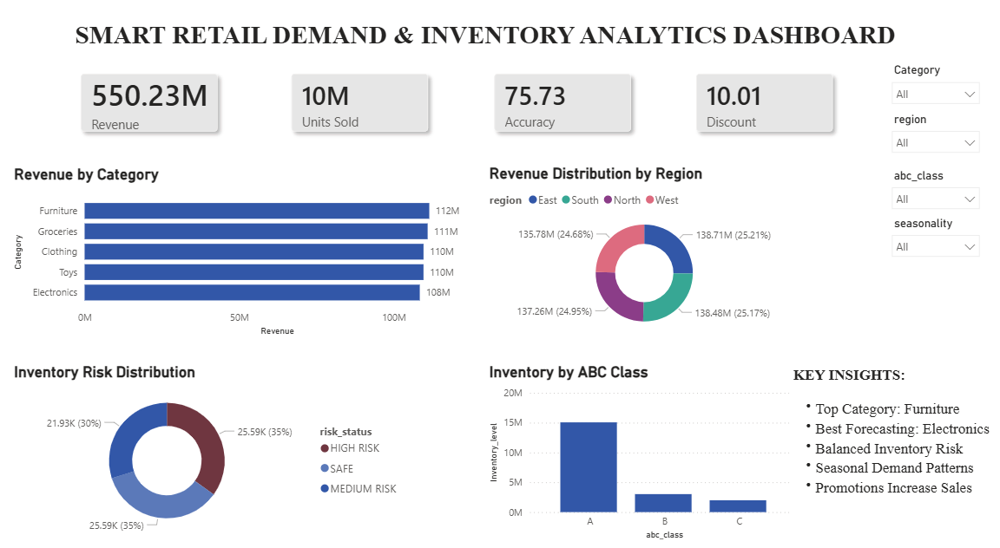
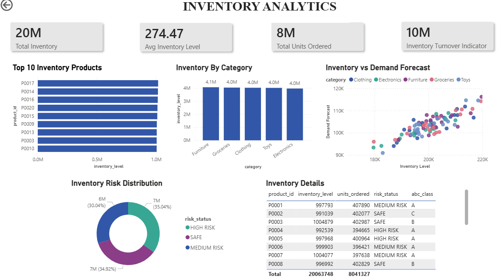
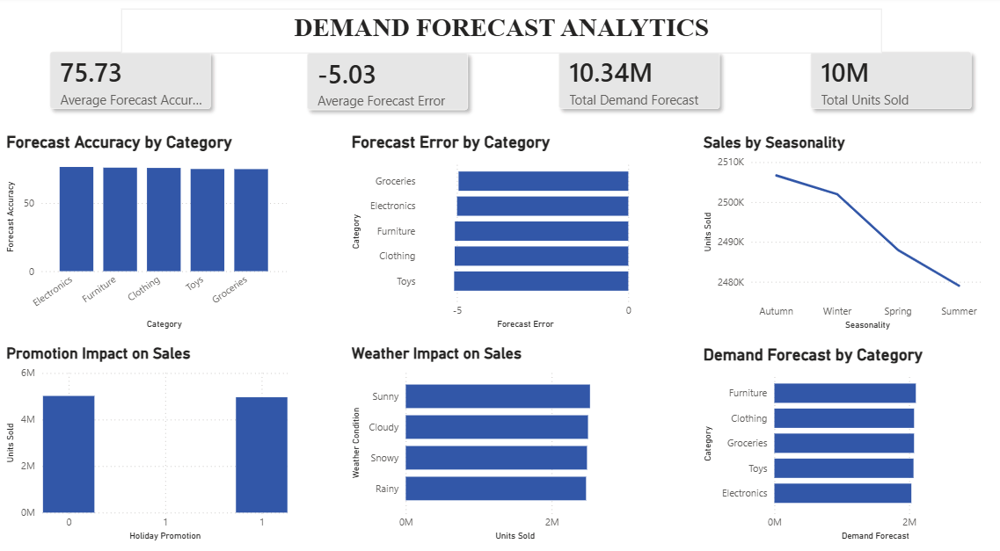

# Smart Retail Demand & Inventory Analytics | Python, Power BI

## Project Overview

Smart Retail Demand & Inventory Analytics is an end-to-end Data Analytics project focused on analyzing retail inventory performance, sales trends, demand forecasting behavior, and inventory risk management.

The project uses Python and Power BI to transform raw retail data into actionable business insights. It covers data cleaning, exploratory data analysis (EDA), inventory analytics, demand forecasting analytics, and dashboard development.

The objective is to help retail businesses optimize inventory planning, understand demand patterns, monitor inventory risks, and improve decision-making through data-driven insights.

## Business Problem

Retail businesses often face challenges such as:

* Overstocking and understocking
* Inventory risk management
* Demand uncertainty
* Seasonal demand fluctuations
* Promotion effectiveness analysis
* Revenue optimization

This project addresses these challenges by analyzing inventory, sales, and forecasting data to identify trends and business opportunities.

## Dataset Features

The dataset contains retail inventory and sales information with the following key attributes:

* Date
* Store ID
* Product ID
* Category
* Region
* Inventory Level
* Units Sold
* Units Ordered
* Demand Forecast
* Price
* Discount
* Weather Condition
* Holiday Promotion
* Competitor Pricing
* Seasonality
* Revenue
* Forecast Error
* Forecast Accuracy
* ABC Classification
* Risk Status

## Tools & Technologies

### Programming & Analytics

* Python
* Jupyter Notebook

### Python Libraries

* Pandas
* NumPy
* Matplotlib
* Seaborn

### Business Intelligence

* Power BI

### Version Control

* Git
* GitHub

## Project Workflow

```
Data Understanding
        ↓
Data Cleaning
        ↓
Exploratory Data Analysis (EDA)
        ↓
Inventory Analytics
        ↓
Demand Forecast Analytics
        ↓
Power BI Dashboard Development
```

## Project Structure

```
smart-retail-demand-inventory-analytics/

├── data/
│
├── notebooks/
│   ├── 01_data_understanding.ipynb
│   ├── 02_data_cleaning.ipynb
│   ├── 03_eda.ipynb
│   ├── 04_inventory_analytics.ipynb
│   ├── 05_demand_forecasting_analytics.ipynb
│   └── 06_dashboard_dataset.ipynb
│
├── sql/
│
├── dashboard/
│
├── screenshots/
│
├── requirements.txt
│
└── README.md
```

## Dashboard Overview

### Page 1 – Executive Dashboard

Features:

* Total Revenue KPI
* Total Units Sold KPI
* Average Forecast Accuracy KPI
* Revenue by Category
* Revenue by Region
* ABC Classification Analysis
* Inventory Risk Distribution
* Key Business Insights

### Dashboard Preview



---

### Page 2 – Inventory Analytics

Features:

* Top Inventory Products
* Inventory by Category
* Inventory vs Demand Forecast Analysis
* Inventory Risk Distribution
* Inventory Details Table

### Dashboard Preview



---

### Page 3 – Demand Forecast Analytics

Features:

* Forecast Accuracy by Category
* Forecast Error by Category
* Sales by Seasonality
* Promotion Impact on Sales
* Weather Impact on Sales
* Demand Forecast by Category

### Dashboard Preview



## Key Business Findings

* Furniture generated the highest revenue among all categories.
* Furniture recorded the highest demand forecast.
* Electronics achieved the highest forecasting accuracy.
* Inventory risk remained relatively balanced across all risk segments.
* Seasonal demand patterns influenced sales performance.
* Promotional campaigns positively impacted sales volume.

## Business Recommendations

* Maintain sufficient inventory levels for high-performing product categories.
* Improve forecasting practices across all categories using high-accuracy forecasting strategies.
* Monitor high-risk inventory products regularly.
* Align procurement planning with seasonal demand trends.
* Increase promotional activities during peak demand periods.
* Use forecasting insights for proactive inventory management.

## Additional SQL Practice

Business-oriented SQL queries were created for learning and analysis purposes, including:

* Revenue by Category
* Regional Performance Analysis
* Inventory Risk Analysis
* Product Performance Analysis

SQL scripts are available in the `sql/` directory.

## Future Enhancements

* Machine Learning-based demand forecasting
* Inventory optimization models
* Automated reporting pipelines
* Real-time analytics dashboards
* Predictive analytics for sales forecasting

## Author

### Riya Goel

Aspiring Data Analyst | AI & ML Enthusiast

GitHub: https://github.com/RiyaGoel21
